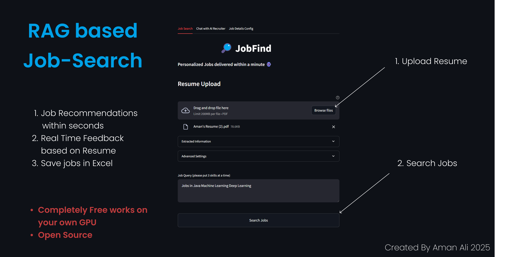

# Job Finder



<video width="640" height="360" controls>
  <source src="jobfind.mp4" type="job/mp4">
  Your browser does not support the video tag.
</video>


Setup your account, generate API Key here: [https://rapidapi.com/letscrape-6bRBa3QguO5/api/jsearch]

1. create a virtual environment & check out into it

On Windows:

```bash
 python -m venv notion-venv .\notion-venv\Scripts\activate
```

On macOS/Linux:

```bash
python3 -m venv notion-venv source notion-venv/bin/activate
```

Install Required Dependencies Ensure you have a requirements.txt file in your repository.
Then run:

```bash
pip install -r requirements.txt
```

2. install dependencies

```bash
pip install -r requirements.txt
```

3. Run the application using streamlit

```bash
streamlit run JobFind.py
```

Credits to Krish Naik for this projects inspiration
